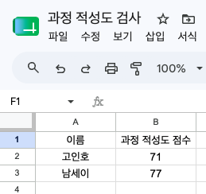
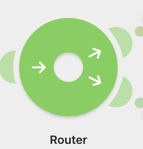
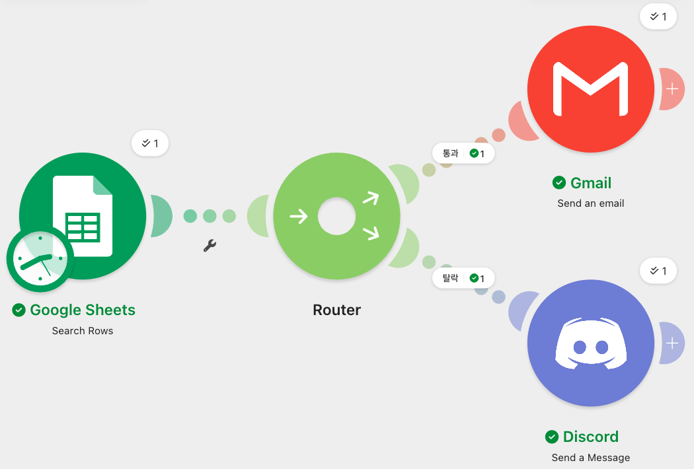
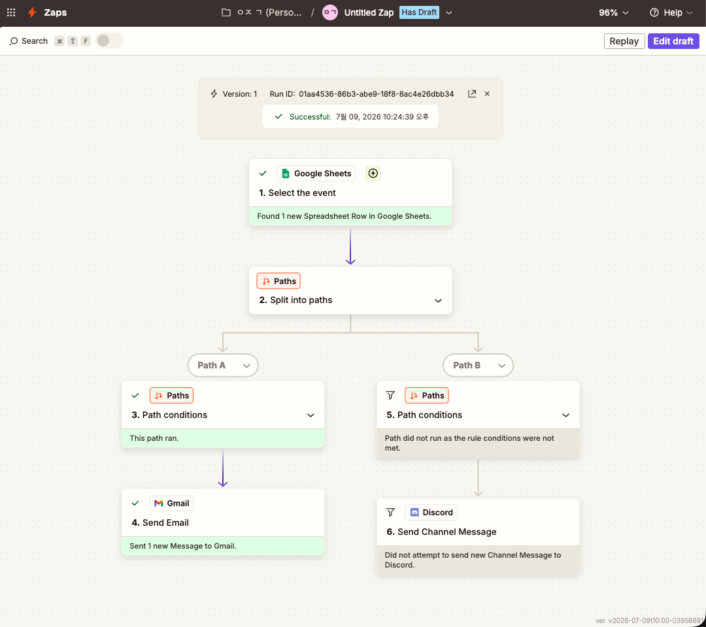
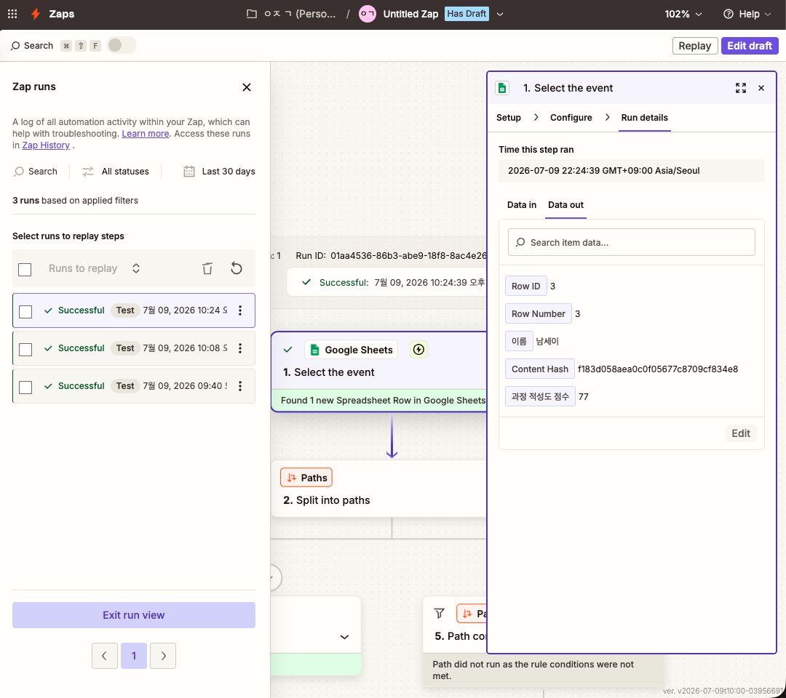
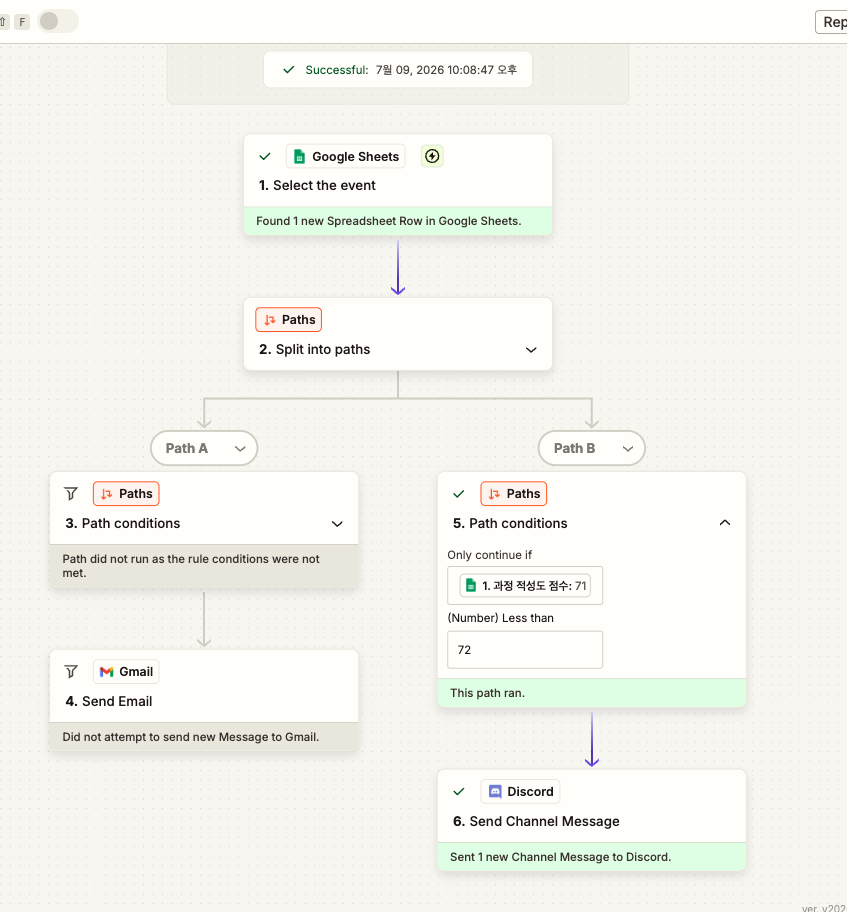
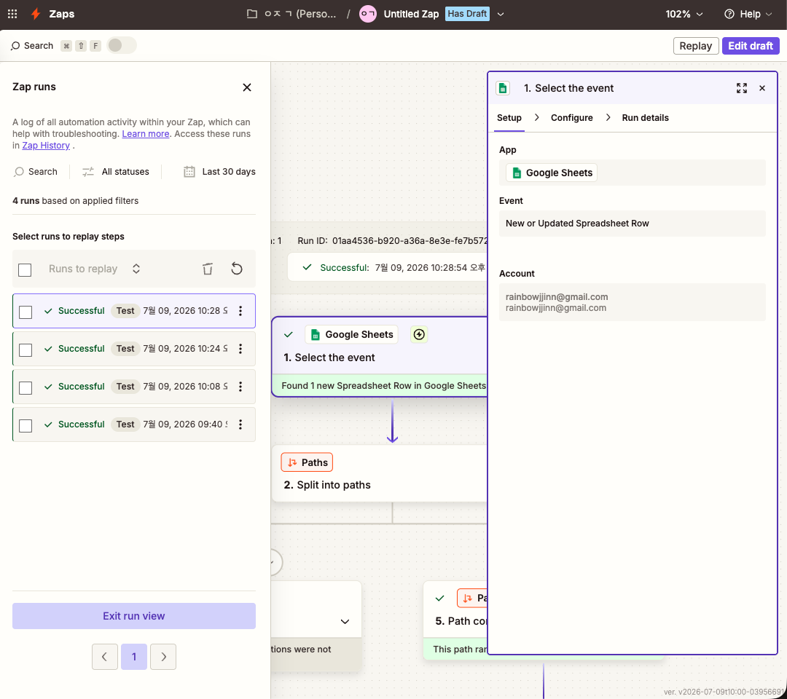

#  <프로젝트 1> 자동화 도구 비교하기  
## (make & Zapier)

 

## 📊 과정적성도_Make 자동화_큰이미지

| 분류/단계 | 프로세스 (기능) | 설정 및 세부 구성 내용 | 설정 화면 / 결과 이미지 |
| :---: | :--- | :--- | :--- |
| ⚡ **[트리거] 01** | **데이터 수집** (Google Sheets) | • 모듈: Search Rows (행 찾기) • 연동 파일: 과정 적성도 검사 • 연동 시트: 점수 • 범위: A-CZ 전체 열 스캔 **※ 자동화 워크플로우를 작동시키는 최초의 출발점** |  |
| 🔀 **[조건 분기] 02** | **조건 분기 시작** (Router) | • 구글 시트에서 명단을 읽어온 후, 라우터(Router)를 통해 합격자와 탈락자의 경로를 실시간으로 분기 처리하는 허브 형성 |  |
| 🛡️ **[조건 분기] 03** | **경로 1: 통과 필터** (Filter) | • 조건명(Label): 통과 • 조건식: 과정 적성도 점수 (B) • 연산자: **Greater than or equal to (72점 이상)** • 기준 점수: 72 |  |
| 🚀 **[최종 액션 1] 04** | **경로 1: 알림 발송** (Gmail) | • 수신처: `rai*******@gmail.com` *(※ 마스킹 처리)* • 제목: 과정 적성도 검사 결과 알림 • **본문 내용**: `[이름 (A)] 님 과정 적성도 검사 결과 통과하셨습니다. 홈페이지에서 접수를 진행해주세요!` **※ 요구 사항 만족: 통과 경로의 최종 출력 행동 (Action 1)** |  |
| 🛡️ **[조건 분기] 05** | **경로 2: 탈락 필터** (Filter) | • 조건명(Label): 탈락 • 조건식: 과정 적성도 점수 (B) • 연산자: **Less than (72점 미만)** • 기준 점수: 72 **※ 72점 경계값의 중복 분기 오류를 방지하기 위해 '미만' 연산자 적용** |  |
| 🚀 **[최종 액션 2] 06** | **경로 2: 알림 발송** (Discord) | • 방식: Send a Message to a Channel • 채널 ID: 알림 *(※ 토큰 노출 없음)* • **메시지 내용**: `[이름 (A)] 님 과정 적성도 검사 결과 탈락하셨습니다. 내년에 도전해 주세요!` **※ 요구 사항 만족: 탈락 경로의 최종 출력 행동 (Action 2)** |  |
| 🏁 **[실행 증명] 07** | **최종 실행 결과** (Scenario 완공) | • [Run once] 성공 스코어: 통과 1건 ➔ 지메일 발송 완료 / 탈락 1건 ➔ 디스코드 발송 완료 **※ 요구 사항에 따른 각 분기 경로(통과/탈락)가 실제로 1회 이상 완벽하게 실행되었음을 증명** |  |

     

# 📊 과정적성도_Make 자동화 워크플로우

| 단계 | 프로세스 (기능) | 설정 및 세부 구성 내용 | 설정 화면 / 결과 이미지 |
| :---: | :--- | :--- | :--- |
| **01** | **데이터 수집** (Google Sheets) | • 모듈: `Search Rows` (행 찾기) • 연동 파일: `과정 적성도 검사` • 연동 시트: `점수` • 범위: `A-CZ` 전체 열 스캔 |  |
| **02** | **조건 분기 시작** (Router) | • 구글 시트에서 명단을 읽어온 후, 라우터(Router)를 통해 합격자와 탈락자의 경로를 실시간으로 분기 처리하는 허브 형성 |  |
| **03** | **경로 1: 통과 필터** (Filter) | • 조건명(Label): 통과 • 조건식: `과정 적성도 점수 (B)` • 연산자: `Numeric operators: Greater than or equal to` (이상이면) • 기준 점수: `72` |  |
| **04** | **경로 1: 알림 발송** (Gmail) | • 수신처: `rainbow****@gmail.com` • 제목: 과정 적성도 검사 결과 알림 • 본문 내용: `[이름 (A)]` 님 과정 적성도 검사 결과 통과하셨습니다. 홈페이지에서 접수를 진행해주세요! |  |
| **05** | **경로 2: 탈락 필터** (Filter) | • 조건명(Label): 탈락 • 조건식: `과정 적성도 점수 (B)` • 연산자: `Numeric operators: Less than` (미만이면) • 기준 점수: `72` |  |
| **06** | **경로 2: 알림 발송** (Discord) | • 방식: `Send a Message to a Channel` • 채널 ID: `알림` (공개 채널) • 메시지: `[이름 (A)]` 님 과정 적성도 검사 결과 탈락하셨습니다. 내년에 도전해 주세요! |  |
| **07** | **최종 실행 결과** (Scenario 완공) | • `[Run once]` 성공 스코어: 통과 1건 ➔ 지메일 발송 완료 / 탈락 1건 ➔ 디스코드 발송 완료 (최종 정상 가동 증명) |  |

    
# make 실행결과 

## * 메이크 통과자 알림_G메일
 
   

## * 메이크 탈락자 알림_discord
 
         

 
 

# 📊 과정적성도_ Zapier 자동화 워크플로우 

## Zapier 통과자 설계
 
       

## Zapier 통과자 성공 로그
 
      

## Zapier 탈락자 설계
  
      

## Zapier 탈락자 성공 로그
 
     

# Zapier 실행 결과  

## * Zapier 통과자 알림_G메일  
 
      

## * Zapier 탈락자 알림_discord 
 
     

### 📢 자동화 도구별 최종 알림 결과

| 툴 (Platform) | 📧 (Gmail) 합격 알림 결과 | 💬 (Discord) 탈락 알림 결과 |
| :---: | :--- | :--- |
| **🛠️ Make** *(메이크)* | **[Make] 남세이 지원자 합격 메일**    • 구글 시트 전체 조회를 통해 발송된 합격 통보 메일 화면입니다. | **[Make] 고인호 지원자 탈락 알림**    • 라우터 분기를 거쳐 디스코드 채널로 동시 배달된 알림 화면입니다. |
| **⚡ Zapier** *(자피어)* | **[Zapier] 남세이 지원자 합격 메일**    • 실시간 행 추가 트리거 감수 후 경로 A를 타고 발송된 메일 화면입니다. | **[Zapier] 고인호 지원자 탈락 알림**    • 경로 B 검문소를 통과하여 디스코드 봇이 실시간으로 쏜 알림 화면입니다. |  
------

 
      

## * **make 와 Zapier 5개 항목 비교(장단점)**

| 비교 항목 | Make (메이크) | Zapier (자피어) |
| :--- | :--- | :--- |
| **① UI/UX 구조** | 비주얼 마인드맵 형태의 시각적 캔버스 (자유로운 모듈 배치) | 위에서 아래로 흐르는 직관적인 일직선(수직) 리스트 형태 |
| **② 설정 난이도** | 데이터 맵핑 및 함수 활용 시 개발자 수준의 논리적 이해 필요 (높음) | 직관적인 가이드 위주의 마법사 방식으로 비개발자 접근성 우수 (낮음) |
| **③ 연동 서비스 범위** | 전 세계 주요 앱 대부분 연동 가능하나, 국내 특화 앱은 커스텀 필요 | 연동 가능한 앱의 종류가 전 세계에서 가장 방대함 (압도적) |
| **④ 무료 플랜 범위** | • 월 1,000 Operations 무료 제공 • **무료 플랜에서도 조건 분기(Router) 무제한 사용 가능** | • 월 100 Tasks 무료 제공 • **조건 분기(Paths) 기능은 유료 플랜 또는 트라이얼에서만 제공** |
| **⑤ 실행 로그 확인** | 버블 모양의 시각적 아이콘(인스펙터)으로 데이터의 흐름을 직관적으로 추적 | 'Zap History' 메뉴를 통해 텍스트 기반의 타임라인 로그 형태로 확인 |  

   

## * make & Zapier 활용 비교

| 비교 항목 | 메이크 (Make) | 자피어 (Zapier) |
| :--- | :--- | :--- |
| **시각적 UI 형태** | **2차원 무한 도화지(Canvas) 구조** · 게임 화면이나 지도(Map)처럼 마우스 휠로 자유롭게 확대/축소하며 사방으로 이동하는 네트워크형 공간 | **1차원 하향식 목록(List) 구조** · 위에서 아래로 순서대로 차곡차곡 블록이 쌓여 내려가는 문서형/직렬형 공간 |
| **시각적 강점 및 분기 표현** | **시원하게 찢어지는 선로형 분기** · 중앙의 라우터 동그라미를 중심으로 실제 기차 선로가 갈라지듯 선이 위아래 대각선 방향으로 찢어져 가독성이 극대화됨 | **답답한 종방향 비대화 구조** · 분기 발생 시 화면이 사방으로 펼쳐지지 못하고, 큰 상자 내부에 하위 상자가 수직으로 겹겹이 중첩(Nested)되어 아래로만 길어짐 |
| **데이터 연산 시각화** | **연결선 위 투명한 깃발 노출** · 윗길/아랫길 연결선 위에 필터 조건과 함수 문법이 깃발처럼 투명하게 드러나, 화면 이동 없이 **1초 만에 전체 아키텍처 조망 가능** | **베일에 싸인 불투명한 노출** · 분기 조건이나 연산 과정을 보려면 해당 상자를 일일이 클릭하여 내부 서랍 페이지로 깊숙이 진입해야 하므로 흐름 추적이 불편함 |
| **무료 플랜 제약 조건** | **너그러운 기능 개방** · 무료 플랜에서도 라우터(Router) 제공 · 하나의 데이터를 여러 경로로 **'동시 병렬 전송'** 가능 | **구조적 한계 (직렬 방식만 허용)** · 액션 2개 사용은 가능하나, **'동시 병렬 전송' 및 조건 분기(Paths) 불가** · 반드시 위에서 아래로 순서대로만 실행되는 일직선 구조만 무료 제공 |
| **최적의 활용 용도 (무료 테스트 관점)** | **본격적인 비즈니스 로직 모의실험 (MVP)** · 비용 지출 없이 **다중 병렬 전송(디스코드 발송 + 시트 상태 업데이트)**과 데이터 정제가 포함된 복잡한 업무를 끝까지 시험해 보고 싶을 때 적합 | **단순 기능 검증 및 직렬 자동화** · 복잡한 경로 분기나 동시 처리 없이, 앱과 앱 간의 순차적인 연동(단계 1 완료 후 단계 2 실행) 위주로 빠르게 테스트해 보고 싶을 때 적합 |
| **💡 적합한 실제 활용 예시** | **[다중 병렬 분기] 쇼핑몰 주문 데이터 실시간 분류 처리** · 구글 시트에 주문서가 들어오면, **동시에** 라우터를 통해 데이터를 복사한 뒤 제품 유형에 따라 **[VIP 고객이면 ➡️ 이메일 감사장]**, **[일반 고객이면 ➡️ 카카오톡 안내]**, **[도매 고객이면 ➡️ 물류창고 슬랙 알림]**으로 각각 완전히 다른 조건의 메시지를 사방으로 동시 전송하는 업무 | **[단선 직렬 연동] 리드(고객) 정보 즉시 알림** · (무료기능에서) 구글 설문지에 새로운 고객 정보가 접수되면, 어떠한 조건 분기나 필터링도 없이 곧바로 담당자의 이메일로 발송하고, 이어서 담당자 슬랙으로 내용을 전달하는 **일직선 순차 전달** 업무 |
     

# * 선정도구:  make  
     

## * make 선정 이유  

| 선정 도구 | 핵심 선정 이유 (어필 포인트) | 주제에 적합한 이유 (실무적 관점) |
| :---: | :--- | :--- |
| **🧱 Make (메이크)** | **"무료 플랜에서도 필터, 조건 분기(Router)가 무제한 가동됩니다!"**  • 과제 핵심인 '과금 리스크 완화 가이드'에 완벽 부합 • 비용 결제 장벽 없이 100% 무과금 구현 가능 | • 하나의 데이터를 '통과'와 '탈락'으로 찢어주는 **라우터 분기 구조가 필수적인 주제**이므로, 이를 무료로 제공하는 Make가 가장 경제적임. • 경계값(72점) 필터 통과 여부를 시각적 버블로 즉시 검증할 수 있어 실행 증명 캡처가 매우 명확함. |
--------------------

     

### * 그럼에도 Zapier를 실무에서 써야하는 이유 * 

| 선정 도구 | (어필 포인트) | (실무적 관점) |
| :---: | :--- | :--- |
| **🚡 Zapier (자피어)** | **"에러 스트레스 없이 단 10분 만에 워크플로우가 완성됩니다!"**  • 복잡한 논리 구조나 연결 선 없이 일직선 구축 가능 • 비개발자 맞춤형 가이드(마법사 방식)로 난이도 최하 | • 데이터 매핑이나 세부 함수 설정에서 발생할 수 있는 휴먼 에러를 최소화하여 **빠르고 안정적인 과제 제출**에 극도로 유리함. • 글로벌 표준의 정돈된 리스트형 UI 덕분에 보고서를 채점하는 평가자 관점에서도 가독성이 매우 뛰어남. |  

## * 좀 더! (G메일 서비스에서)  
 ### 📋 자피어 지메일 액션(Send Email)의 실무(기업) 활용 서비스 항목들

| 💡 핵심 | 분류 | 항목 이름 (영문명) | 내부 식별 ID / 옵션값 | 실무 관점에서의 기능 및 핵심 역할 |
| :---: | :--- | :--- | :--- | :--- |
| | **1. 수발신 주소 (Address)** | **To** `(필수)` | 이메일 주소 직접 입력 또는 데이터 매핑 | **메일을 받을 주 수신자**입니다. • **실무 활용:** 실제 운영 시에는 구글 시트의 [지원자 이메일] 열을 매핑하여 합격자에게 자동으로 발송되게 만듭니다. |
| | | **Cc** | 이메일 주소 입력 | **참조(Carbon Copy)**입니다. • **실무 활용:** 인사담당자가 지원자에게 메일을 보낼 때, 팀장님이나 같은 부서 공용 메일을 참조에 넣어 '내가 이 메일을 보냈다'는 것을 팀 내에 공유할 때 씁니다. |
| | | **Bcc** | 이메일 주소 입력 | **숨은 참조(Blind Carbon Copy)**입니다. • **실무 활용:** 메일을 받는 지원자에게는 보이지 않게 하면서, 회사의 아카이브(기록 보관용) 메일함으로 발송 내역을 몰래 백업해 둘 때 아주 유용합니다. |
| | | **From** | 연동된 계정 목록 | **메일을 보내는 발신 주소**입니다. • **실무 활용:** 개인 메일이 아닌 `contact@company.com` 같은 회사 공용 구글 워크스페이스 계정을 자피어에 연동해 두면, 이 칸에서 회사 공식 메일을 발신인으로 지정할 수 있습니다. |
| **💡** | | **From Name** | 텍스트 입력 | **수신자 메일함에 주소 대신 노출될 발신자 이름/회사명 (브랜드 신뢰)** • **실무 활용:** 이메일 주소만 덩그러니 가면 스팸처럼 보일 수 있으므로, **이노AI 채용담당자**처럼 회사나 브랜드명을 수기로 명확히 적어 수신율과 신뢰도를 높입니다. |
| **💡** | | **Reply To** | 이메일 주소 입력 | **수신자가 '답장'을 누를 때 실제 답장이 접수될 주소 (업무 분리 효율화)** • **실무 활용:** 메일은 시스템 자동 발송용 주소(`no-reply@company.com`)로 쏘더라도, 지원자가 문의 사항을 묻는 답장을 보냈을 때는 실제 담당자 메일(`hr@company.com`)로 쏙 들어오게 분리할 때 사용합니다. |
| | **2. 본문 및 제목 (Content)** | **Subject** `(필수)` | 텍스트 입력 | **이메일의 제목**을 작성하는 필수 칸입니다. |
| **💡** | | **Body Type** | `plain` / `html` | **본문 포맷 결정** • **Plain:** 순수 텍스트 전송 (가장 안전함) • **HTML:** 회사 로고 이미지, 서식, 홈페이지 이동 버튼 등을 이쁘게 디자인해서 보낼 때 필수적입니다. |
| | | **Body** `(필수)` | 텍스트 및 데이터 매핑 | **이메일의 본문 내용**입니다. 구글 시트에서 넘어온 [남세이] 같은 이름 변수와 안내 문구를 조합하여 동적 메일을 완성합니다. |
| **💡** | **3. 서명 및 관리 (Signature & More)** | **Add signature default** | 선택 박스 | **내 지메일 계정에 이미 등록된 공식 회사 서명 자동 연동 (법적 리스크 예방)** • 회사 주소, 대표 번호, 공식 로고 및 법적 책임 한계 고지문(Disclaimer)을 메일 하단에 자동으로 포함시켜 자동화 발송 시 발생할 수 있는 법적 분쟁을 사전 예방합니다. |
| **💡** | | **Signature delimiter** | `True` / `False` | **본문과 회사 서명 사이의 구분선(`--`) 추가 여부** • 글로벌 메일 규격을 준수하여 격식을 높입니다. (※ 서명이 비어있을 경우 엔진이 자동으로 무시하므로 오작동 위험이 없습니다.) |
| **💡** | | **Label or mailbox** | 지메일 라벨 목록 | **발송된 자동화 메일들의 특정 업무 폴더 자동 분류 (동적 데이터 박제 및 증빙 관리)** • **실무 활용:** 발송 순간의 동적 데이터(`[남세이]` 등 이름 변수)와 도달 시간을 세트로 묶어 개별 문서로 보관함으로써 데이터 무결성을 보장하고, **감사나 분쟁 발생 시 완벽한 면책 증빙 자료**로 활용합니다. |
| | | **Attachments** | 텍스트 및 URL 매핑 | **합격증, 회사 소개서 PDF 등의 파일 자동 첨부** • **실무 활용:** 구글 시트나 드라이브에 저장된 파일의 다운로드 링크(URL)를 동적으로 매핑해 두면 자피어가 알아서 파일을 얹어 발송하므로, 수작업 첨부 리소스를 완전 제로화합니다. |
| **💡** | | **Send message to Google Contacts...** | `True` / `False` | **메일 발송과 동시에 수신자의 연락처를 구글 주소록에 자동 등록 (CRM 인맥 자산화)** • **실무 활용:** 해당 지원자를 주소록 내 특정 그룹(예: `[2026년 상반기 지원자]`)에 자동 분류 연동합니다. 무거운 문서 보관(라벨 메일박스)과 기능을 분리하여 경량화를 유지하면서도, 추후 단체 공지(SMS 등) 시 1초 만에 명단을 추출하게 돕습니다. |
| | **4. 공통 고급 메뉴** | **세로 점 3개 (⋮)** | `Use a Custom Value` `Reset to Default` | 각 항목 우측의 고급 메뉴입니다. • **Custom Value:** 고정된 값 대신 코딩하듯 변수를 강제로 주입할 때 사용 • **Reset:** 설정을 잘못 건드렸을 때 초기 깨끗한 상태로 복구 |  
--------------------------

### **결론: 기업에서 실무로 유료로 사용하고자 할 때는 Zapier를 권함**  
    
