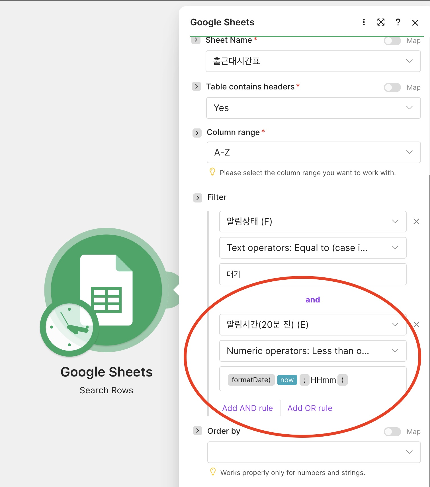
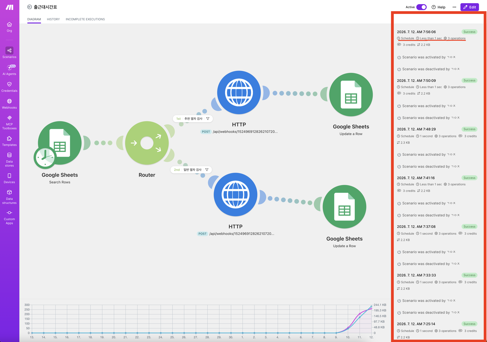
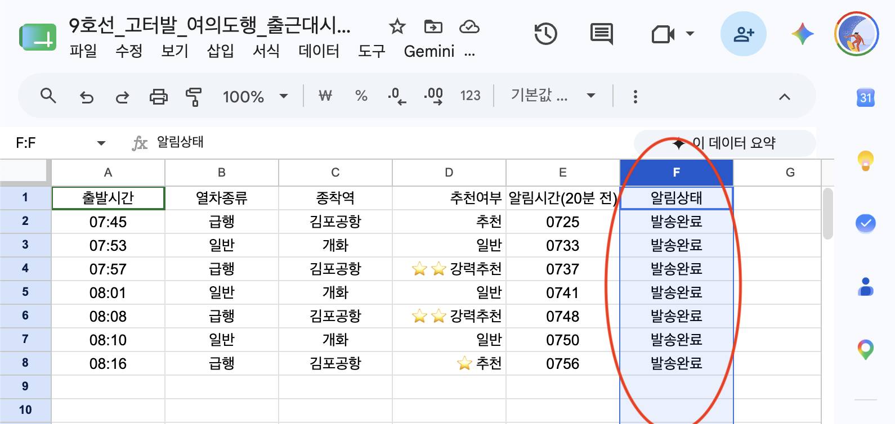

## 📊 프로젝트 핵심 요약 구성표 (Summary)

### 1. 프로젝트 기본 정보
| 항목 | 내용 |
| :--- | :--- |
| **프로젝트명** | 출근 시간대 전철 시간표 자동 알림 시스템 |
| **핵심 기능** | 구글 시트 시간표 실시간 감시 ➡️ 지정 시간 디스코드 알림 발송 ➡️ 시트 상태 자동 업데이트 |

### 2. 시스템 아키텍처 개요
| 출발지 (Data Source) | **제어** 레이어 (Filter & Router) | 목적지 (Final Action) |
| :--- | :--- | :--- |
| **[구글 시트 DB]** 출근 시간표 데이터 | **[시간 포맷팅 범위 필터]** 현재 시간 도래 여부 판정 ⬇️ **[메이크 라우터]** 프로세스 다중 분기 처리 | ➡️ **[경로 A]** 디스코드 알림 발송 채널 ➡️ **[경로 B]** 구글 시트 상태 업데이트 (발송완료) |

### 3. 핵심 워크플로우 4단계
| 단계 | 프로세스명 | 주요 동작 내용 |
| :---: | :--- | :--- |
| **01** | **데이터 로드** | 메이크(Make) 스케줄러가 구글 시트의 시간표 데이터를 정기적으로 로드 |
| **02** | **조건 필터링** | `알림상태 = 대기` 이면서 현재 시간이 도래한 대상 행만 정밀 통과 |
| **03** | **다중 분기 처리** | 라우터를 통해 알림 발송 액션과 시트 상태 제어 액션을 독립적으로 분기 |
| **04** | **최종 액션** | 디스코드 커스텀 가이드 발송 및 해당 행을 `발송완료`로 변경하여 중복 방지 |

   

## 4. 구현 및 실행 증빙 자료 (Artifacts)

 

## 📊 증빙 파일 일람표
| 순번 | 구분 | 파일명 명세 | 핵심 확인 요인 (평가 포인트) |
| :---: | :--- | :--- | :--- |
| **01** | **핵심 로직** | `time_formatting_hhmm.jpeg` | 특수문자를 제거한 시간 범위 연산자(`Numeric operator`) 조건 설정 검증 |
| **02** | **아키텍처** | `schedule_success_complete.png` | 메이크(Make) 전체 시나리오 컴포넌트 구성 및 라우팅 구조와 결과 |
| **03** | **데이터베이스**| `upload_complete.png` | 알림 처리 완료 후 구글 시트 내 `알림상태` 값의 '발송완료' 상태 확인 |
| **04** | **최종 출력** | `discord_alert_complete.png` | 실제 디스코드 채널로 수신된 급행/일반 열차 맞춤형 커스텀 메시지 |

---

### 📷 세부 증빙 스크린샷

#### ① 시간 포맷팅 및 범위 연산자 필터 설정  
  

#### ② 시나리오 전체 아키텍처 및 성공결과
  

#### ③ 구글 시트 상태 업데이트 결과 
  

#### ④ 디스코드 최종 알림 수신 결과  
  

   

### 5. 향후 고도화 백로그 (Backlog)
| 우선순위 | 개발 일감명 | 핵심 고도화 내용 |
| :---: | :--- | :--- |
| **Next** | **자정 데이터 클렌징** | 매일 자정 `발송완료` 데이터를 일괄 리셋/초기화하여 유지보수가 필요 없는 자율형 리소스 관리 구현 |