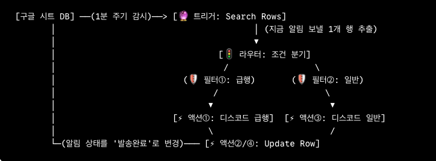
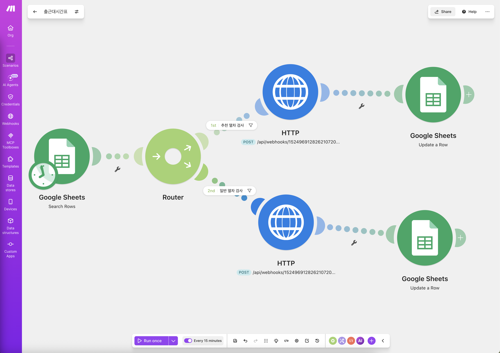

# 🚄 여의도 주 4일제 출근 직장인의 출근시간대 열차 시간 알림 자동화 서비스 

>>> ### -구글 시트 기반의 대기 큐(Queue)와 고효율 타이머 스케줄링을 결합한 여의도 직장인 맞춤형 열차 알림 시스템-

---

## 📌 1. 프로젝트 개요 (Overview)
본 프로젝트는 주 4일제(월~목)로 여의도에 출근하는 직장인을 위해, 열차 출발 시각 정확히 20분 전에 디스코드로 맞춤형 알림을 전송하는 비용 최적화형 자동화 시스템입니다. 독립적인 서버 구축 없이 Make(iPaaS)와 Google Sheets만을 연동하여 안정적인  데이터 파이프라인을 구현했습니다.

---

## 🛠️ 2. 시스템 아키텍처 및 워크플로우 (Architecture)  
  
---   
  

## 📂 3. 평가 필수 요소별 컴포넌트 명세 (Component Specification)
본 자동화 시나리오는 메이크(Make) 공식 아키텍처 기준에 따라 **[🔮 트리거 1개], [🚦 라우터 1개], [🛡️ 필터 2개], [⚡ 액션 4개]**의 독립된 컴포넌트로 명확하게 구성되어 있습니다.

### 🔮 ① 트리거 (Trigger) : 총 1개
* **사용 모듈:** `Google Sheets - Search Rows` (1개)
* **기능:** 평일(월~목) 오전 07:00 ~ 오전 08:10 사이 1분 주기로 가동하며, 당일 출근 시각 데이터를 스캔하는 시스템의 유일한 시작점입니다. (하루 총 71분만 정밀 가동하여 불필요한 시스템 리소스 낭비를 최소화함)
* **안전 메커니즘:** `Maximum returned rows = 1` 설정을 통해 한 번에 오직 1개의 행만 호출하여 데이터 동시성 충돌을 원천 차단합니다.

### 🚦 ② 라우터 (Router) : 총 1개
* **사용 모듈:** `Router` (1개)
* **기능:** 트리거로부터 넘겨받은 열차 데이터를 판별하여 데이터의 흐름을 2개의 독립된 경로(급행 노선 / 일반 노선)로 명확하게 분기시키는 역할을 수행합니다.

### 🛡️ ③ 필터 (Filter) : 총 2개
* **사용 위치:** 라우터 분기 직후의 각 이동 경로(연결선)
* **조건 명세:**
  * **🛡️ 필터 ① (급행 경로):** 열차 등급이 '급행' 또는 '별표'인 경우만 통과시키는 조건문 (우선순위 배치)
  * **🛡️ 필터 ② (일반 경로):** 열차 등급이 '일반'인 경우만 통과시키는 조건문

### ⚡ ④ 액션 (Action) : 총 4개
라우터와 필터를 거쳐 분기된 2개의 경로에 각각 2개씩, 총 4개의 실행형 모듈이 배치되어 실질적인 프로세스를 완료합니다.

* **🚀 [별표/급행 열차 경로]**
  * **⚡ 액션 ① (외부 전송):** `Discord / HTTP(웹훅)` — 디스코드 급행 열차 채널로 강조 알림 메시지 발송
  * **⚡ 액션 ② (상태 제어):** `Google Sheets - Update a Row` — 발송 완료 후 해당 행의 상태를 '발송완료'로 업데이트
* **🚶 [일반 열차 경로]**
  * **⚡ 액션 ③ (외부 전송):** `Discord / HTTP(웹훅)` — 디스코드 일반 열차 채널로 맞춤형 출근 알림 메시지 발송
  * **⚡ 액션 ④ (상태 제어):** `Google Sheets - Update a Row` — 발송 완료 후 해당 행의 상태를 '발송완료'로 업데이트

---

## ✨ 4. 기술적 차별점 요약 (Key Highlights)

* **큐(Queue) 구조 기반의 순차 처리**
  행 제한(Limit: 1)과 상태 변경(대기 ➡️ 발송완료) 액션을 유기적으로 결합하여, 데이터 누락이나 꼬임 현상이 없는 안전한 순차 처리 파이프라인을 형성했습니다.
* **타임 윈도우(Time-windowed) 스케줄링**
  주 4일 근무일 외 요일 및 출근 시간대 외의 불필요한 트리거 호출을 전면 차단하여 효율적인 시스템 운영 최적화를 달성했습니다.  

## ✨ 5. 향후 시스템 고도화 로드맵: 자정 일괄 데이터 클렌징 (Future Roadmap)

>### 5-1. 도입 배경 및 필요성
* 현재 시스템은 알림 발송이 완료되면 중복 발송을 방지하기 위해 대기 상태를 '발송완료'로 전이시킴.
* 단, 한 번 '발송완료'로 전환된 데이터는 상태가 다시 '대기'로 업데이트되지 않는 한 다음 날 재사용이 불가능한 한계가 존재함.

>### 5-2. 설계 안 (Data Cleansing Architecture)
* **자정 스케줄링 트리거:** 매일 밤 자정(00:00)에만 단 한 번 작동하는 별도의 크론탭(Crontab) 스케줄러 트리거를 구성함.
* **대상 데이터 조회:** 구글 시트에서 알림 상태 값이 '발송완료'로 잠겨 있는 당일의 과거 행(Row)들을 일괄 검색함.
* **벌크 초기화 (Bulk Reset):** 검색된 행들의 상태를 다음 날 스케줄 운영을 위해 다시 '대기'로 리셋하는 자동화 공정을 추가함. 

> **💡 기대 효과 및 의의**  
> 해당 클렌징 아키텍처는 데이터 정제 및 스케줄러 다중 분기 운영을 위한 추가 개발이 필요하지만, 향후 대규모 데이터 정제 및 관리형 자동화 서비스로 나아가기 위한 핵심 프로토타입(표준 시제품 모델)으로서 높은 가치를 지닙니다.  